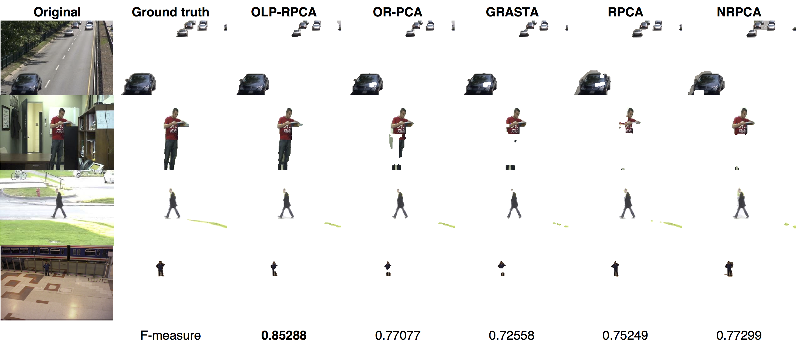
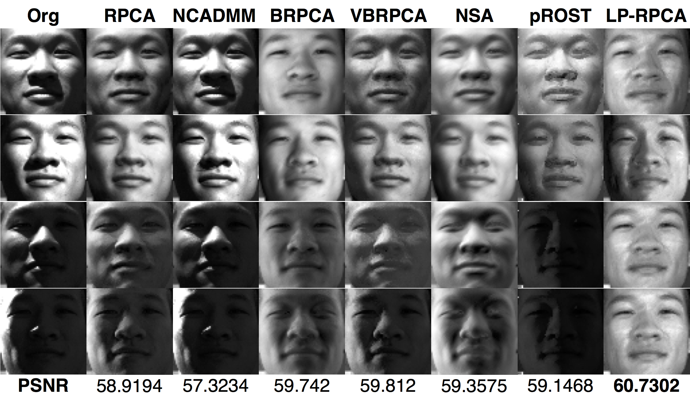

# OLP-RPCA
Online Non-convex ℓp-norm Robust PCA

Kha Gia Quach, Chi Nhan Duong, Khoa Luu, Tien D. Bui

### Introduction

This is the repository for Online Non-Convex ℓp-norm Robust PCA (OLP-RPCA). This paper is published in Computer Vision and Image Understanding (CVIU) Journal. [here](http://www.sciencedirect.com/science/article/pii/S1077314217300450).
 
 If you find OLP-RPCA useful for your research, please consider citing
 
     @article{quach2017non,
        Author = {Quach, Kha Gia and Duong, Chi Nhan and Luu, Khoa and Bui, Tien D},
        Title = {Non-convex online robust PCA: Enhance sparsity via ℓ p-norm minimization},
        Journal = {Computer Vision and Image Understanding},
        Year = {2017},
        Publisher = {Elsevier}
     }

### Resources

0. Video Inpainting results: [GoogleDrive](https://onedrive.live.com/?authkey=%21ABB_CV2zvCEoNK0&id=F371D9563727B96F%2192190&cid=F371D9563727B96F)
0. Code of OLP-RPCA is coming soon!
